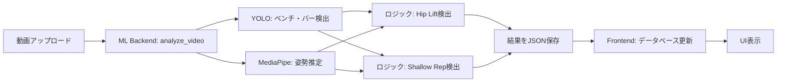

# Stats Display Logic Documentation

このドキュメントは、処理後動画のページに表示されるスタッツ（Overall StatusとForm Analysis）の決定ロジックを説明します。

## 概要

処理後動画のページには、以下の3つの主要なセクションがあります：

1. **Overall Status** - 全体的な評価（GOOD REP または EGO LIFT）
2. **Form Analysis** - フォーム分析の詳細
   - Hip Lift（腰の持ち上げ）
   - Shallow Rep（浅い動作）
3. **Video Info** - 動画の基本情報

## 表示されるスタッツの決定ロジック

### 1. Overall Status（全体的なステータス）

**表示場所**: `/frontend/src/app/videos/[id]/page.tsx` (行127-137)

**決定ロジック**:
```typescript
// ML Backend: ml-backend/app/logic.py (行276-282, 330-334)
if (hip_lift_status != STATUS_OK || shallow_rep_status != STATUS_OK) {
    overall_status = "EGO LIFT"  // 赤色で表示
} else {
    overall_status = "GOOD REP"  // 緑色で表示
}
```

**表示値**:
- `GOOD REP` - Hip LiftとShallow Repの両方が検出されなかった場合（フォームが良好）
- `EGO LIFT` - Hip LiftまたはShallow Repのいずれかが検出された場合（フォームに問題あり）

**カラー**:
- `GOOD REP`: 緑色のバッジ
- `EGO LIFT`: 赤色のバッジ

### 2. Form Analysis - Hip Lift（腰の持ち上げ検出）

**表示場所**: `/frontend/src/app/videos/[id]/page.tsx` (行144-147)

**決定ロジック**: `ml-backend/app/logic.py` (行206-221)

#### 検出アルゴリズム:

1. **ベースライン確立**:
   ```python
   # 最初のフレームで腰とベンチの距離を記録
   baseline_hip_bench_dist = abs(current_hip_y - bench_top_y)
   dynamic_hip_threshold = baseline_hip_bench_dist * HIP_LIFT_RATIO  # 0.5
   ```

2. **違反検出**:
   ```python
   # 現在の腰の位置がベースラインから大幅に離れている場合
   if current_hip_bench_dist > (baseline_hip_bench_dist + dynamic_hip_threshold):
       hip_lift_status = "FAIL: HIP LIFT"
   ```

**表示値**:
- `OK` - Hip Liftが検出されなかった（緑色のバッジ）
- `FAIL: HIP LIFT` - Hip Liftが検出された（赤色のバッジ）

**検出条件**:
- ベンチが検出されている
- 現在の腰とベンチの距離が、ベースライン距離 + (ベースライン距離 × 0.5) を超える

**定数**: `HIP_LIFT_RATIO = 0.5` (ml-backend/app/logic.py:29)

### 3. Form Analysis - Shallow Rep（浅い動作検出）

**表示場所**: `/frontend/src/app/videos/[id]/page.tsx` (行149-154)

**決定ロジック**: `ml-backend/app/logic.py` (行223-256)

#### 検出アルゴリズム:

ステートマシンを使用して、各レップ（反復）を追跡します。

1. **レップ開始検出**:
   ```python
   # バーが肩に近づいたときにレップ開始
   if not is_in_rep and current_bar_shoulder_dist < (min_bar_shoulder_dist - 30):
       is_in_rep = True
       min_elbow_y_at_bottom = current_elbow_y  # 最低点の肘位置を記録
   ```

2. **レップ終了・判定**:
   ```python
   # バーが肩から離れたときにレップ終了
   if is_in_rep and current_bar_shoulder_dist > (min_bar_shoulder_dist + 30):
       # 肘がベンチの高さよりも高い位置にある場合（浅い動作）
       if min_elbow_y_at_bottom > (bench_top_y + dynamic_shallow_threshold):
           shallow_rep_status = "FAIL: ELBOW DEPTH"
   ```

**表示値**:
- `OK` - Shallow Repが検出されなかった（緑色のバッジ）
- `FAIL: ELBOW DEPTH` - Shallow Repが検出された（赤色のバッジ）

**検出条件**:
- バーとベンチが両方検出されている
- レップの最下点で、肘の位置がベンチの高さ + (胴体長 × 0.05) よりも高い

**定数**: `SHALLOW_REP_RATIO = 0.05` (ml-backend/app/logic.py:30)

### 4. Video Info（動画情報）

**表示場所**: `/frontend/src/app/videos/[id]/page.tsx` (行159-175)

**データソース**: 動画解析時に自動的に取得

**表示項目**:
```typescript
{
  totalFrames: number,     // 総フレーム数
  fps: number,            // フレームレート（1秒あたりのフレーム数）
  videoDuration: float    // 動画の長さ（秒）
}
```

**計算方法**:
```python
# ml-backend/app/logic.py (行98-101)
fps = int(cap.get(cv2.CAP_PROP_FPS))
total_frames = int(cap.get(cv2.CAP_PROP_FRAME_COUNT))
video_duration = total_frames / fps  # 秒単位
```

## データフロー

### 1. 解析プロセス



### 2. 結果の保存

**JSON出力**: `ml-backend/app/logic.py` (行336-353)
```python
results = {
    "overall_status": "GOOD REP" or "EGO LIFT",
    "hip_lift_status": "OK" or "FAIL: HIP LIFT",
    "shallow_rep_status": "OK" or "FAIL: ELBOW DEPTH",
    "hip_lift_detected": bool,
    "shallow_rep_detected": bool,
    "time_series_data": [...],
    "total_frames": int,
    "fps": int,
    "video_duration": float
}
```

**ポーリング**: `frontend/src/app/api/analyze/route.ts` (行88-157の`pollForCompletion`関数)
- 5秒ごとにポーリング（最大120回 = 10分間）
- 処理済み動画ファイルとJSON結果ファイルの存在を確認
- タイムアウト時は動画ステータスをFAILEDに設定

**データベース保存**: `frontend/src/app/api/analyze/route.ts` (行126-141)
```typescript
await prisma.video.update({
  where: { id: videoId },
  data: {
    status: "COMPLETED",
    processedPath: outputPath,
    overallStatus: analysisResults.overall_status,
    hipLiftDetected: analysisResults.hip_lift_detected,
    hipLiftStatus: analysisResults.hip_lift_status,
    shallowRepDetected: analysisResults.shallow_rep_detected,
    shallowRepStatus: analysisResults.shallow_rep_status,
    totalFrames: analysisResults.total_frames,
    fps: analysisResults.fps,
    videoDuration: analysisResults.video_duration,
  },
})
```

### 3. UI表示

**UIコンポーネント**: `frontend/src/app/videos/[id]/page.tsx`

#### Overall Statusカード（行126-137）:
```tsx
<Badge 
  variant={video.overallStatus?.includes('GOOD') ? 'default' : 'destructive'}
  className="text-lg px-3 py-1"
>
  {video.overallStatus || 'N/A'}
</Badge>
```

#### Form Analysisカード（行139-156）:
```tsx
// Hip Lift
<Badge variant={video.hipLiftDetected ? 'destructive' : 'default'}>
  {video.hipLiftStatus || 'N/A'}
</Badge>

// Shallow Rep
<Badge variant={video.shallowRepDetected ? 'destructive' : 'default'}>
  {video.shallowRepStatus || 'N/A'}
</Badge>
```

## 技術的詳細

### 使用技術

1. **YOLO (You Only Look Once)**
   - 役割: ベンチとバーベルのリアルタイム物体検出
   - モデル: カスタムトレーニング済みモデル (`best.pt`)
   - クラス:
     - Class 0: バーベル
     - Class 1: ベンチ

2. **MediaPipe Pose**
   - 役割: 人体の姿勢推定（33個のランドマークポイント）
   - 使用ポイント:
     - 腰（左腰・右腰）
     - 肘（左肘・右肘）
     - 肩（左肩・右肩）

3. **OpenCV**
   - 役割: 動画の読み込み、処理、出力
   - コーデック: H.264 (ブラウザ互換性のため)

### パフォーマンス考慮事項

- **スムージング**: 肘の位置は5フレーム移動平均でスムージング
  ```python
  SMOOTHING_WINDOW_SIZE = 5
  elbow_y_buffer = deque(maxlen=SMOOTHING_WINDOW_SIZE)
  smoothed_elbow_y = sum(elbow_y_buffer) / len(elbow_y_buffer)
  ```

- **動的閾値**: 体格の違いに対応するため、胴体の長さに基づいて閾値を動的に調整
  ```python
  avg_torso_length = abs(current_shoulder_y - current_hip_y)
  dynamic_shallow_threshold = avg_torso_length * SHALLOW_REP_RATIO
  ```

## デバッグ・トラブルシューティング

### ログの確認

1. **ML Backend ログ**:
   ```bash
   docker-compose logs ml-backend -f
   ```

2. **Frontend ログ**:
   ```bash
   docker-compose logs frontend -f
   ```

### よくある問題

1. **Overall StatusがN/Aと表示される**
   - 原因: 解析が完了していない、またはJSON結果ファイルが存在しない
   - 確認: `storage/processed-videos/` にJSON ファイルが生成されているか確認

2. **Hip LiftまたはShallow Repが常に検出される**
   - 原因: ベンチまたはバーが正しく検出されていない
   - 確認: YOLO モデルの精度を確認、動画の画質を確認

3. **動画情報が表示されない**
   - 原因: 動画ファイルが破損している、またはコーデックが非対応
   - 確認: OpenCV がファイルを正しく読み込めるか確認

## 設定のカスタマイズ

検出感度を調整したい場合は、以下の定数を変更してください：

**ファイル**: `ml-backend/app/logic.py`

```python
# Hip Lift検出の感度（0.0 - 1.0）
# 値が小さいほど検出が厳しくなる
HIP_LIFT_RATIO = 0.5  # デフォルト: 50%

# Shallow Rep検出の感度（0.0 - 1.0）
# 値が小さいほど検出が厳しくなる
SHALLOW_REP_RATIO = 0.05  # デフォルト: 5%

# 肘位置のスムージングウィンドウサイズ
# 値が大きいほどスムーズだが反応が遅くなる
SMOOTHING_WINDOW_SIZE = 5  # デフォルト: 5フレーム
```

変更後、ML Backendを再起動してください：
```bash
docker-compose restart ml-backend
```

## 参考資料

- [YOLO公式ドキュメント](https://docs.ultralytics.com/)
- [MediaPipe Pose ガイド](https://google.github.io/mediapipe/solutions/pose.html)
- [OpenCV ビデオ処理](https://docs.opencv.org/4.x/dd/d43/tutorial_py_video_display.html)

## 関連ファイル

### Backend
- `ml-backend/app/logic.py` - メインの解析ロジック
- `ml-backend/app/main.py` - FastAPI エンドポイント
- `ml-backend/models/best.pt` - YOLOモデル

### Frontend
- `frontend/src/app/videos/[id]/page.tsx` - 動画詳細ページ（UI表示）
- `frontend/src/app/api/analyze/route.ts` - 解析トリガーとポーリング
- `frontend/prisma/schema.prisma` - データベーススキーマ
- `frontend/src/hooks/useVideoStatus.ts` - ビデオステータス取得フック

---

最終更新日: 2026-01-19
